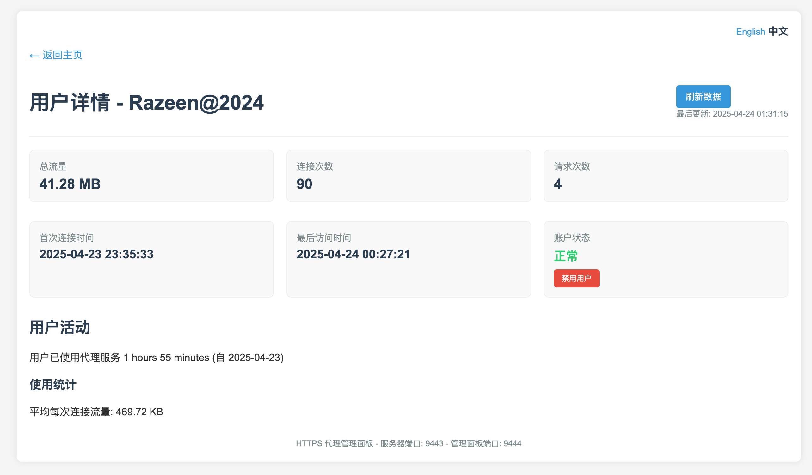
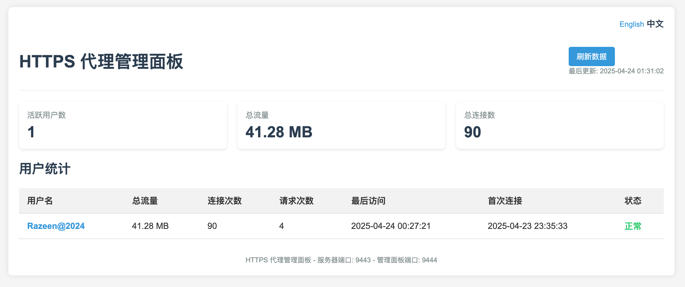

# HTTPS Proxy | HTTPS 代理

<p align="center">
  <a href="#english">English</a> | <a href="#chinese">中文</a>
</p>

<a name="english"></a>

## Overview

HTTPS Proxy is a secure, certificate-based authentication proxy server for controlling and monitoring HTTPS connections. It provides detailed traffic statistics and an admin dashboard for real-time monitoring.



## Features

- ✅ Client certificate-based authentication
- ✅ TLS certificate chain verification against trusted CA
- ✅ Certificate usage verification for client authentication
- ✅ Detailed user traffic statistics tracking
- ✅ **Multi-dimensional traffic analytics** (per-domain, per-user, per-country)
- ✅ **SQLite-based persistent statistics** with async batch processing
- ✅ **GeoIP region mapping** (MaxMind GeoLite2)
- ✅ Web-based admin dashboard
- ✅ **Modern Dashboard v2** with Chart.js trends & Leaflet.js world map
- ✅ Bilingual interface (English/Chinese)
- ✅ Multiple deployment options (service, Docker)
- ✅ Cross-platform support (Linux, macOS, Windows)

## Installation

### Prerequisites

- Go 1.24 or higher (for building from source)
- OpenSSL (for certificate generation)

### Quick Install with Script

```bash
# For Linux (requires sudo)
curl -sSL https://raw.githubusercontent.com/razeencheng/https-proxy/main/scripts/install.sh | sudo bash

# For macOS (requires sudo)
curl -sSL https://raw.githubusercontent.com/razeencheng/https-proxy/main/scripts/install.sh | sudo bash
```

### Manual Installation

1. Download the latest release for your platform from [GitHub Releases](https://github.com/razeencheng/https-proxy/releases)
2. Extract the archive and run the installation script:

```bash
# Linux
sudo ./deploy/install_linux.sh

# macOS
sudo ./deploy/install_macos.sh
```

### Docker Deployment

```bash
# Clone the repository
git clone https://github.com/razeencheng/https-proxy.git
cd https-proxy

# Build and start the container
docker-compose up -d
```

## Configuration

The configuration is stored in `config.json` (development) or `/etc/https-proxy/config.json` (production).

### Configuration Structure

```json
{
  "server": {
    "address": "0.0.0.0:8443",
    "cert_file": "./certs/cert.pem",
    "key_file": "./certs/key.pem",
    "language": "en"
  },
  "proxy": {
    "trust_root_file": "./certs/trustroot.pem",
    "auth_required": true
  },
  "geoip": {
    "enabled": true,
    "db_path": "./data/GeoLite2-Country.mmdb"
  },
  "stats": {
    "enabled": true,
    "db_path": "./stats/proxy_stats.db",
    "file_path": "./stats/proxy_stats.json",
    "flush_interval_seconds": 30,
    "retention": {
      "minute_stats_days": 7,
      "hourly_stats_days": 90
    }
  },
  "admin": {
    "enabled": true,
    "address": "127.0.0.1:8444",
    "cert_file": "./certs/admin_cert.pem",
    "key_file": "./certs/admin_key.pem"
  }
}
```

### Key Configuration Options

| Section | Option | Description |
|---------|--------|-------------|
| server | address | Proxy server listening address and port |
| server | language | UI language: 'en' for English, 'zh' for Chinese |
| proxy | auth_required | Enable/disable client certificate verification |
| geoip | enabled | Enable GeoIP region-based statistics |
| geoip | db_path | Path to MaxMind GeoLite2-Country.mmdb |
| stats | db_path | Path to SQLite statistics database |
| stats | flush_interval_seconds | How often to flush stats from memory to database |
| stats | retention | Data retention policy (minute/hourly stats days) |
| admin | address | Admin dashboard listening address and port |

## Certificate Management

For testing, generate self-signed certificates:

```bash
./scripts/generate_certs.sh
```

This creates:
- CA certificate (ca.pem)
- Server certificates (cert.pem/key.pem)
- Admin certificates (admin_cert.pem/admin_key.pem)
- Client certificate (client.pem/client.key)
- Browser-importable PKCS#12 file (client.p12)

For production, use your trusted CA certificates.

## Using the Proxy

### Client Setup

1. Import the client certificate (client.p12) into your browser
2. Configure your browser to use the proxy (default: localhost:8443)
3. When prompted, select your client certificate

### Admin Dashboard

Access the admin dashboard at https://localhost:8444 (or configured address).

- **Legacy Dashboard** (`/`): Basic user stats table
- **Dashboard v2** (`/dashboard/`): Modern UI with traffic trends, domain rankings, and world map

The v2 dashboard provides:

- Real-time KPI cards (upload/download/connections/domains/countries)
- Traffic trend charts (30m / 1h / 24h / 7d)
- Top domains and user rankings
- Country/region traffic distribution with interactive world map
- Dark/light theme toggle



## API Reference

The admin panel provides the following API endpoints:

### Legacy API (v1)

- `GET /api/stats`: Get statistics for all users
- `GET /api/stats/user/{username}`: Get statistics for a specific user
- `GET /api/config`: Get server configuration

### API v2 (new)

- `GET /api/v2/overview`: Global overview (upload/download/connections/domains/countries)
- `GET /api/v2/users`: User list with detailed stats
- `GET /api/v2/users/{username}`: Single user details
- `GET /api/v2/domains?limit=N&user=X`: Top domains ranking
- `GET /api/v2/trends?range=30m|1h|24h|7d`: Time-series traffic trends
- `GET /api/v2/countries`: Country traffic ranking

## Upgrade

### Quick Upgrade (one-liner)

```bash
curl -sSL https://raw.githubusercontent.com/razeencheng/https-proxy/main/scripts/upgrade.sh | sudo bash
```

### Manual Upgrade

```bash
# Build the new binary
make build

# Linux
sudo ./deploy/upgrade_linux.sh

# macOS
sudo ./deploy/upgrade_macos.sh
```

See [deploy/README.md](deploy/README.md) for detailed upgrade instructions.

## Uninstallation

```bash
# Linux
sudo ./deploy/uninstall_linux.sh

# macOS
sudo ./deploy/uninstall_macos.sh
```

## Development

### Building from Source

```bash
# Clone the repository
git clone https://github.com/razeencheng/https-proxy.git
cd https-proxy

# Build the binary
go build -ldflags="-w -s" -o https-proxy

# Run with default config
./https-proxy
```

### Creating Releases

This project uses GitHub Actions to automatically build and release binaries:

1. Tag the commit: `git tag -a v1.0.0 -m "Version 1.0.0"`
2. Push the tag: `git push origin v1.0.0`

## License

This software is provided under the terms of the MIT License.

---

<a name="chinese"></a>

# HTTPS 代理

## 概述

HTTPS 代理是一个安全的基于证书认证的代理服务器，用于控制和监控 HTTPS 连接。它提供详细的流量统计和管理员仪表板，以进行实时监控。


## 特性

- ✅ 基于客户端证书的身份验证
- ✅ 对受信任 CA 的 TLS 证书链验证
- ✅ 针对客户端身份验证的证书用途验证
- ✅ 详细的用户流量统计跟踪
- ✅ **多维度流量分析**（按域名、用户、国家/地区）
- ✅ **SQLite 持久化统计**（异步批量处理）
- ✅ **GeoIP 地区映射**（MaxMind GeoLite2）
- ✅ 基于 Web 的管理仪表板
- ✅ **现代化 Dashboard v2**（Chart.js 趋势图 + Leaflet.js 世界地图）
- ✅ 双语界面（英文/中文）
- ✅ 多种部署选项（系统服务、Docker）
- ✅ 跨平台支持（Linux、macOS、Windows）

## 安装

### 前提条件

- Go 1.24 或更高版本（用于从源代码构建）
- OpenSSL（用于证书生成）

### 使用脚本快速安装

```bash
# Linux（需要 sudo）
curl -sSL https://raw.githubusercontent.com/razeencheng/https-proxy/main/scripts/install.sh | sudo bash

# macOS（需要 sudo）
curl -sSL https://raw.githubusercontent.com/razeencheng/https-proxy/main/scripts/install.sh | sudo bash
```

### 手动安装

1. 从 [GitHub Releases](https://github.com/razeencheng/https-proxy/releases) 下载适合您平台的最新版本
2. 解压缩归档文件并运行安装脚本：

```bash
# Linux
sudo ./deploy/install_linux.sh

# macOS
sudo ./deploy/install_macos.sh
```

### Docker 部署

```bash
# 克隆仓库
git clone https://github.com/razeencheng/https-proxy.git
cd https-proxy

# 构建并启动容器
docker-compose up -d
```

## 配置

配置存储在 `config.json`（开发环境）或 `/etc/https-proxy/config.json`（生产环境）中。

### 配置结构

```json
{
  "server": {
    "address": "0.0.0.0:8443",
    "cert_file": "./certs/cert.pem",
    "key_file": "./certs/key.pem",
    "language": "en"
  },
  "proxy": {
    "trust_root_file": "./certs/trustroot.pem",
    "auth_required": true
  },
  "geoip": {
    "enabled": true,
    "db_path": "./data/GeoLite2-Country.mmdb"
  },
  "stats": {
    "enabled": true,
    "db_path": "./stats/proxy_stats.db",
    "file_path": "./stats/proxy_stats.json",
    "flush_interval_seconds": 30,
    "retention": {
      "minute_stats_days": 7,
      "hourly_stats_days": 90
    }
  },
  "admin": {
    "enabled": true,
    "address": "127.0.0.1:8444",
    "cert_file": "./certs/admin_cert.pem",
    "key_file": "./certs/admin_key.pem"
  }
}
```

### 主要配置选项

| 部分 | 选项 | 描述 |
|------|------|------|
| server | address | 代理服务器监听地址和端口 |
| server | language | UI 语言：'en' 为英文，'zh' 为中文 |
| proxy | auth_required | 启用/禁用客户端证书验证 |
| geoip | enabled | 启用 GeoIP 地区统计 |
| geoip | db_path | MaxMind GeoLite2-Country.mmdb 文件路径 |
| stats | db_path | SQLite 统计数据库路径 |
| stats | flush_interval_seconds | 内存统计刷入数据库的间隔（秒） |
| stats | retention | 数据保留策略（分钟/小时级统计天数） |
| admin | address | 管理仪表板监听地址和端口 |

## 证书管理

对于测试，生成自签名证书：

```bash
./scripts/generate_certs.sh
```

这将创建：
- CA 证书 (ca.pem)
- 服务器证书 (cert.pem/key.pem)
- 管理员证书 (admin_cert.pem/admin_key.pem)
- 客户端证书 (client.pem/client.key)
- 可导入浏览器的 PKCS#12 文件 (client.p12)

对于生产环境，使用您的受信任 CA 证书。

## 使用代理

### 客户端设置

1. 将客户端证书 (client.p12) 导入到您的浏览器中
2. 配置您的浏览器使用代理（默认：localhost:8443）
3. 提示时，选择您的客户端证书

### 管理仪表板

通过 https://localhost:8444（或配置的地址）访问管理仪表板。

- **旧版面板** (`/`)：基础用户统计表格
- **Dashboard v2** (`/dashboard/`)：现代化 UI，包含流量趋势、域名排行和世界地图

v2 仪表板提供：

- 实时 KPI 卡片（上传/下载/连接数/域名数/国家数）
- 流量趋势图（30m / 1h / 24h / 7d）
- 域名和用户排行榜
- 国家/地区流量分布与交互式世界地图
- 暗色/亮色主题切换


## API 参考

管理面板提供以下 API 端点：

### 旧版 API (v1)

- `GET /api/stats`：获取所有用户的统计信息
- `GET /api/stats/user/{username}`：获取特定用户的统计信息
- `GET /api/config`：获取服务器配置

### API v2（新）

- `GET /api/v2/overview`：全局概览（上传/下载/连接数/域名数/国家数）
- `GET /api/v2/users`：用户列表及详细统计
- `GET /api/v2/users/{username}`：单用户详情
- `GET /api/v2/domains?limit=N&user=X`：域名排行榜
- `GET /api/v2/trends?range=30m|1h|24h|7d`：时序流量趋势
- `GET /api/v2/countries`：国家流量排行

## 升级

### 一键升级

```bash
curl -sSL https://raw.githubusercontent.com/razeencheng/https-proxy/main/scripts/upgrade.sh | sudo bash
```

### 手动升级

```bash
# 构建新版 binary
make build

# Linux
sudo ./deploy/upgrade_linux.sh

# macOS
sudo ./deploy/upgrade_macos.sh
```

详见 [deploy/README.md](deploy/README.md) 中的升级指南。

## 卸载

```bash
# Linux
sudo ./deploy/uninstall_linux.sh

# macOS
sudo ./deploy/uninstall_macos.sh
```

## 开发

### 从源代码构建

```bash
# 克隆仓库
git clone https://github.com/razeencheng/https-proxy.git
cd https-proxy

# 构建二进制文件
go build -ldflags="-w -s" -o https-proxy

# 使用默认配置运行
./https-proxy
```

### 创建发布版本

该项目使用 GitHub Actions 自动构建和发布二进制文件：

1. 标记提交：`git tag -a v1.0.0 -m "Version 1.0.0"`
2. 推送标签：`git push origin v1.0.0`

## 许可证

本软件根据 MIT 许可证条款提供。
